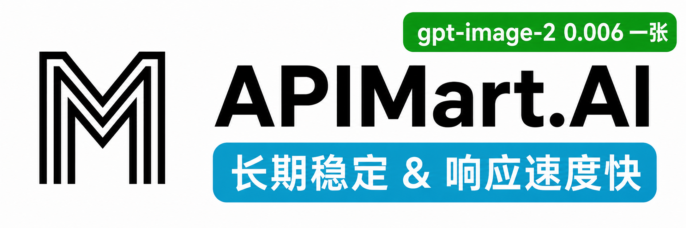

# Cockpit Tools

[English](README.en.md) · [Portuguese (BR)](README.pt-br.md) · [简体中文](README.md) · 한국어

[](https://github.com/jlcodes99/cockpit-tools)
[](https://github.com/jlcodes99/cockpit-tools/releases)
[](https://github.com/jlcodes99/cockpit-tools/releases)
[](https://github.com/jlcodes99/cockpit-tools/issues)

**범용 AI IDE 계정 관리 도구**입니다. 현재 **Antigravity IDE**, **Codex**, **GitHub Copilot**, **Windsurf**, **Kiro**, **Cursor**, **Grok CLI**, **CodeBuddy**, **CodeBuddy CN**, **Qoder**, **Trae**, **TRAE SOLO**, **Trae CN**, **TRAE SOLO CN**, **Zed**, **ZCode**를 지원하며, 다중 계정·다중 인스턴스 병렬 실행을 제공합니다.

> 여러 AI IDE 계정을 효율적으로 관리하도록 돕는 도구입니다. 원클릭 계정 전환, 쿼터 모니터링, 깨우기 작업, 다중 인스턴스 병렬 실행을 지원하므로 서로 다른 계정의 자원을 충분히 활용할 수 있습니다.

**주요 기능**: 원클릭 계정 전환 · 다중 계정 관리 · 다중 인스턴스 · 쿼터 모니터링 · 깨우기 작업 · 플러그인 연동 · GitHub Copilot 관리 · Windsurf 관리 · Kiro 관리 · Cursor 관리 · Grok CLI 관리 · CodeBuddy 관리 · CodeBuddy CN 관리 · Qoder 관리 · Trae 스위트 관리 · Zed 관리 · ZCode 관리

**언어**: 18개 언어 지원

🇺🇸 English · 🇨🇳 简体中文 · 繁體中文 · 🇯🇵 日本語 · 🇩🇪 Deutsch · 🇪🇸 Español · 🇫🇷 Français · 🇮🇹 Italiano · 🇰🇷 한국어 · 🇧🇷 Português · 🇷🇺 Русский · 🇹🇷 Türkçe · 🇵🇱 Polski · 🇨🇿 Čeština · 🇸🇦 العربية · 🇻🇳 Tiếng Việt · 🇮🇩 Bahasa Indonesia

**공식 지원 플랫폼**: macOS, Windows, Linux.

---

## 스폰서

<table>
  <tr>
    <td width="120" align="center">
      <a href="https://apikey.fun/register?aff=COCKPIT">
        
      </a>
    </td>
    <td>
      <a href="https://apikey.fun/register?aff=COCKPIT"><strong>APIKEY.FUN</strong></a>은(는) 기업과 개인 개발자를 위해 안정적이고 효율적이며 저렴한 AI 모델 API 연동을 제공하는 전문 기업급 서비스입니다. Claude, OpenAI, Gemini 등 주요 인기 모델을 지원하며, 가격은 공식 가격의 7%까지 저렴합니다. 이 프로젝트의 <a href="https://apikey.fun/register?aff=COCKPIT"><strong>전용 링크</strong></a>로 가입하면 <strong>충전 시 5% 할인</strong>을 상시 받을 수 있습니다.
    </td>
  </tr>
  <tr>
    <td width="120" align="center">
      <a href="https://go.apimart.ai/gh-cockpit-tools">
        
      </a>
    </td>
    <td>
      이 프로젝트를 후원해 주신 <a href="https://go.apimart.ai/gh-cockpit-tools"><strong>APIMart</strong></a>께 감사드립니다. <a href="https://go.apimart.ai/gh-cockpit-tools"><strong>APIMart</strong></a>는 AI 이미지·영상 생성용 저가 API 플랫폼으로, GPT-Image-2가 <strong>이미지당 $0.006</strong>부터, <strong>1달러당 160장 이상</strong>을 생성할 수 있습니다. 하나의 비동기 API로 이미지와 영상 모두 처리할 수 있으며, 작업 제출 후 ID를 받아 콜백이나 폴링으로 결과를 가져옵니다. 시간 초과 없이 <strong>수만 장</strong> 단위의 일괄 처리가 가능하고, 모델을 바꿔도 코드를 수정할 필요가 없습니다. 월정액 없이 사용량 기반 과금이며 <a href="https://go.apimart.ai/gh-cockpit-tools"><strong>이 링크로 가입</strong></a>하면 바로 시작할 수 있습니다.
    </td>
  </tr>
  <tr>
    <td width="120" align="center">
      <a href="https://roxybrowser.cn?code=0326VTDA">
        
      </a>
    </td>
    <td>
      <a href="https://roxybrowser.cn?code=0326VTDA"><strong>RoxyBrowser</strong></a>는 다중 계정 운영과 AI 자동화 시나리오를 위한 지문 브라우저로, 독립적인 브라우저 지문 환경, Cookie/저장소 격리, Roxy 네이티브 주거용 IP, 팀 협업, API/MCP 자동화를 지원합니다. AI 계정 매트릭스 관리, 계정 연관 위험 감소, 장기 사용 안정성 향상에 적합합니다. Cockpit <a href="https://roxybrowser.cn?code=0326VTDA"><strong>초대 링크</strong></a>로 가입 또는 구매하면 팬 할인 10%를 받을 수 있습니다.
    </td>
  </tr>
</table>

---

## 기능 개요

### 1. 대시보드 (Dashboard)

새롭게 설계된 시각적 대시보드로 한 곳에서 전체 상태를 확인할 수 있습니다:

- **16개 플랫폼 지원**: Antigravity IDE, Codex, GitHub Copilot, Windsurf, Kiro, Cursor, Grok CLI, CodeBuddy, CodeBuddy CN, Qoder, Trae, TRAE SOLO, Trae CN, TRAE SOLO CN, Zed, ZCode의 계정 상태를 동시에 표시
- **쿼터 모니터링**: 모델별 남은 쿼터와 초기화 시점을 실시간으로 확인
- **빠른 작업**: 원클릭 새로고침, 원클릭 깨우기
- **시각적 진행률**: 쿼터 소비량을 직관적인 진행 막대로 표시

> 

### 2. Antigravity IDE 계정 관리

- **원클릭 계정 전환**: 수동 로그인/로그아웃 없이 현재 사용 중인 계정을 즉시 전환
- **다양한 가져오기 방식**: OAuth 인증, Refresh Token, 플러그인 동기화
- **깨우기 작업**: AI 모델을 예약된 시간에 깨워 쿼터 초기화 주기를 앞당김

> 
>
> *(깨우기 작업)*
> 

#### 2.1 Antigravity IDE 다중 인스턴스

Antigravity IDE 인스턴스를 여러 개 실행하고 서로 다른 계정을 사용할 수 있습니다. 예를 들어 Antigravity IDE 두 개를 동시에 열어 각각 다른 계정에 연결한 뒤, 서로 다른 프로젝트를 독립적으로 처리할 수 있습니다.

- **계정 격리**: 각 인스턴스가 서로 다른 계정에 연결되어 독립적으로 실행
- **프로젝트 병렬 처리**: 여러 작업/프로젝트를 동시에 수행
- **매개변수 격리**: 인스턴스 디렉터리와 시작 매개변수를 사용자 지정 가능

> 

### 3. Codex 계정 관리

- **전문화된 지원**: Codex에 최적화된 계정 관리 경험
- **쿼터 표시**: Hourly 및 Weekly 쿼터 상태를 명확하게 표시
- **플랜 식별**: 계정 플랜 유형(Basic, Plus, Team 등)을 자동으로 인식
- **API 서비스**: 로컬 Codex API 서비스는 내장된 CLIProxyAPI 사이드카가 구동합니다. Cockpit Tools는 계정 동기화, 설정 투영, 상태 및 사용량 통계를 담당하며, Base URL과 API Key, 사용자 조작 방식은 그대로 유지됩니다.

> 

#### 3.1 Codex 다중 인스턴스

Codex 역시 다중 계정·다중 인스턴스 병렬 실행을 지원합니다. 예를 들어 Codex 두 개를 동시에 열어 각각 다른 계정에 연결하고, 서로 다른 프로젝트를 독립적으로 처리할 수 있습니다.

- **계정 격리**: 각 인스턴스가 서로 다른 계정에 연결되어 독립적으로 실행
- **프로젝트 병렬 처리**: 여러 작업/프로젝트를 동시에 수행
- **매개변수 격리**: 인스턴스 디렉터리와 시작 매개변수를 사용자 지정 가능

> 

### 4. GitHub Copilot 계정 관리

- **계정 가져오기**: OAuth 인증, Token/JSON 가져오기
- **쿼터 보기**: Inline Suggestions / Chat 메시지 사용량과 초기화 시점 표시
- **플랜 식별**: Free / Individual / Pro / Business / Enterprise 등 플랜 유형을 자동 인식
- **일괄 작업**: 태그와 일괄 작업 지원

#### 4.1 GitHub Copilot 다중 인스턴스

VS Code 기반 Copilot 인스턴스를 격리된 프로필과 수명 주기 제어와 함께 관리합니다.

- **프로필 격리**: 각 인스턴스가 자체 사용자 데이터 디렉터리를 사용
- **빠른 수명 주기 제어**: 인스턴스 시작/종료/강제 종료
- **창 제어**: 인스턴스 창 열기 및 전체 인스턴스 닫기

### 5. Windsurf 계정 관리

- **계정 가져오기**: OAuth 인증, Token/JSON 가져오기, 로컬 가져오기
- **쿼터 보기**: 플랜, User Prompt 크레딧, Add-on prompt 크레딧 및 주기 정보 표시
- **일괄 작업**: 태그와 일괄 작업 지원
- **전환 주입**: 계정 전환 후 Windsurf에 주입하고 실행하는 기능 지원

#### 5.1 Windsurf 다중 인스턴스

Windsurf 인스턴스를 격리된 프로필과 수명 주기 제어와 함께 관리합니다.

- **프로필 격리**: 각 인스턴스가 자체 사용자 데이터 디렉터리를 사용
- **빠른 수명 주기 제어**: 인스턴스 시작/종료/강제 종료
- **창 제어**: 인스턴스 창 열기 및 전체 인스턴스 닫기

### 6. Kiro 계정 관리

- **계정 가져오기**: OAuth 인증, Token/JSON 가져오기, 로컬 가져오기
- **쿼터 보기**: 플랜, User Prompt 크레딧, Add-on prompt 크레딧 및 주기 정보 표시
- **일괄 작업**: 태그와 일괄 작업 지원
- **전환 주입**: 계정 전환 후 Kiro에 주입하고 실행하는 기능 지원

#### 6.1 Kiro 다중 인스턴스

Kiro 인스턴스를 격리된 프로필과 수명 주기 제어와 함께 관리합니다.

- **프로필 격리**: 각 인스턴스가 자체 사용자 데이터 디렉터리를 사용
- **빠른 수명 주기 제어**: 인스턴스 시작/종료/강제 종료
- **창 제어**: 인스턴스 창 열기 및 전체 인스턴스 닫기

### 7. Cursor 계정 관리

- **계정 가져오기**: OAuth 인증, Token/JSON 가져오기, 로컬 가져오기
- **쿼터 보기**: Total Usage, Auto + Composer, API Usage, On-Demand 및 주기 정보 표시
- **일괄 작업**: 태그와 일괄 작업 지원
- **전환 주입**: 계정 전환 후 Cursor에 주입하고 실행하는 기능 지원

#### 7.1 Cursor 다중 인스턴스

Cursor 인스턴스를 격리된 프로필과 수명 주기 제어와 함께 관리합니다.

- **프로필 격리**: 각 인스턴스가 자체 사용자 데이터 디렉터리를 사용
- **빠른 수명 주기 제어**: 인스턴스 시작/종료/강제 종료
- **창 제어**: 인스턴스 창 열기 및 전체 인스턴스 닫기


### 8. Grok CLI 계정 관리

- **OAuth 인증**: xAI 공식 OIDC 디바이스 플로우를 지원하며, 브라우저에서 인증이 완료되면 계정을 저장합니다
- **API 키 및 서드파티 엔드포인트**: xAI 공식 API 키와 함께 OpenAI 호환 서드파티 `Base URL` 및 모델 ID를 지원합니다. 설정은 계정별 `config.toml`에 기록되며, 키는 해당 CLI 프로세스를 시작할 때만 환경 변수로 주입됩니다
- **가져오기 및 마스킹 내보내기**: 기본 `~/.grok/auth.json` 또는 지정한 JSON에서 공식 자격 증명을 가져옵니다. 계정 페이지 내보내기와 범용 계정 백업에는 access token/refresh token이 포함되지 않아 로그인 복원에 사용할 수 없으며, 마이그레이션 시 공식 `auth.json`을 별도로 가져와야 합니다
- **실제 계정 전환**: 선택한 계정을 Grok CLI 공식 registry 형식으로 기본 `~/.grok/auth.json`에 기록하며, 파일 내 다른 registry scope은 그대로 유지합니다
- **쿼터 및 플랜**: 공식 billing/user/subscriptions 엔드포인트를 조회해 주기, 사용량, 제품별 쿼터, 플랜 원시 값을 표시하고 Grok Code 접근 가능 여부를 기록합니다
- **토큰 유지 관리**: access token 자동 갱신, refresh token rotation, 쿼터 경보 지원

#### 8.1 Grok CLI 다중 인스턴스

Grok CLI 기본 인스턴스는 보통 공식 `~/.grok` 디렉터리를 그대로 사용하며 `GROK_HOME`을 설정하지 않고 실행됩니다. 관리되는 인스턴스는 별도의 디렉터리를 사용합니다. 서드파티 엔드포인트를 포함한 API 키 계정은 공식 OAuth 세션이 자격 증명 우선순위를 차지하지 않도록 항상 계정 전용 `GROK_HOME`으로 실행됩니다.

- **계정 바인딩**: 기본 인스턴스는 현재 계정을 따라갈 수 있고, 관리되는 각 인스턴스는 서로 다른 계정을 바인딩할 수 있습니다
- **실행 격리**: 관리되는 인스턴스는 `auth.json`, `config.toml`, 작업 디렉터리, 시작 매개변수가 서로 분리됩니다
- **터미널 수명 주기**: 터미널 실행 명령어 생성 또는 실행, 인스턴스 종료, 전체 인스턴스 닫기 지원
- **디렉터리 보호**: 기본이 아닌 인스턴스는 기본 관리 루트 안에만 생성할 수 있으며, 삭제 시 휴지통으로 이동합니다. 기존 설정에 남아 있는 외부 경로는 등록 해제만 될 뿐 쓰기나 삭제 대상이 되지 않습니다

### 9. CodeBuddy 계정 관리

- **계정 가져오기**: OAuth 인증 및 Token/JSON 가져오기
- **쿼터 보기**: 쿼터 조회, 주기 정보, 추가 크레딧 표시
- **일괄 작업**: 태그와 일괄 작업 지원
- **전환 주입**: 계정 전환 후 CodeBuddy에 주입하고 실행하는 기능 지원

#### 8.1 CodeBuddy 다중 인스턴스

CodeBuddy 인스턴스를 격리된 프로필과 수명 주기 제어와 함께 관리합니다.

- **프로필 격리**: 각 인스턴스가 자체 사용자 데이터 디렉터리를 사용
- **빠른 수명 주기 제어**: 인스턴스 시작/종료/강제 종료
- **창 제어**: 인스턴스 창 열기 및 전체 인스턴스 닫기

### 10. CodeBuddy CN 계정 관리

- **계정 가져오기**: OAuth 인증, Token/JSON 가져오기, 로컬 클라이언트 가져오기 지원
- **쿼터 보기**: 플랜과 사용량 상태를 표시하고, 상세 쿼터 정보는 공식 웹페이지에서 바로 확인할 수 있습니다
- **일괄 작업**: 태그와 일괄 작업 지원
- **전환 주입**: 계정 전환 후 클라이언트의 로컬 인증 저장 규칙에 따라 기록하고 CodeBuddy CN을 실행하는 기능 지원

#### 9.1 CodeBuddy CN 다중 인스턴스

CodeBuddy CN 인스턴스를 격리된 프로필과 수명 주기 제어와 함께 관리합니다.

- **프로필 격리**: 각 인스턴스가 자체 사용자 데이터 디렉터리를 사용
- **빠른 수명 주기 제어**: 인스턴스 시작/종료/강제 종료
- **창 제어**: 인스턴스 창 열기 및 전체 인스턴스 닫기

### 11. Qoder 계정 관리

- **계정 가져오기**: 로컬 가져오기 및 JSON 가져오기 지원
- **쿼터 보기**: Credits 사용량, 남은 크레딧, 플랜 원시 값 표시
- **일괄 작업**: 태그, 필터, 내보내기, 일괄 삭제/새로고침 지원
- **전환 주입**: 계정 전환 후 Qoder에 주입하고 실행하는 기능 지원

#### 10.1 Qoder 다중 인스턴스

Qoder 인스턴스를 격리된 프로필과 수명 주기 제어와 함께 관리합니다.

- **프로필 격리**: 각 인스턴스가 자체 사용자 데이터 디렉터리를 사용
- **빠른 수명 주기 제어**: 인스턴스 시작/종료/강제 종료
- **창 제어**: 인스턴스 창 열기 및 전체 인스턴스 닫기

### 12. Trae 계정 관리

- **계정 가져오기**: 로컬 가져오기 및 JSON 가져오기 지원
- **쿼터 보기**: 플랜 원시 값, 달러 소비액/총 한도, 초기화 시점 표시
- **일괄 작업**: 태그, 필터, 내보내기, 일괄 삭제/새로고침 지원
- **Trae 스위트**: Trae, TRAE SOLO, Trae CN, TRAE SOLO CN 기본 클라이언트의 로컬 가져오기와 전환 주입을 지원하며, 기본적으로 Trae 그룹으로 묶입니다
- **전환 주입**: 각 클라이언트의 실제 디스크 기록 규칙에 따라 인증 상태를 기록하고 대상 클라이언트를 실행하는 기능 지원

#### 11.1 Trae 다중 인스턴스

기존 Trae 클라이언트 인스턴스를 격리된 프로필과 수명 주기 제어와 함께 관리합니다.

- **프로필 격리**: 각 인스턴스가 자체 사용자 데이터 디렉터리를 사용
- **빠른 수명 주기 제어**: 인스턴스 시작/종료/강제 종료
- **창 제어**: 인스턴스 창 열기 및 전체 인스턴스 닫기

### 13. Zed 계정 관리

- **계정 가져오기**: 공식 OAuth 로그인, JSON 가져오기, 현재 로컬 로그인 상태 가져오기 지원
- **사용량 보기**: 구독 상태, Edit Predictions, Token Spend, Spend Limit, 청구 주기 종료일 표시
- **일괄 작업**: 태그, 필터, 내보내기, 일괄 삭제/새로고침 지원
- **전환 주입**: Zed 클라이언트의 실제 로컬 저장 규칙에 따라 선택한 계정을 적용하고, 필요하면 공식 클라이언트를 재시작합니다

### 14. ZCode 계정 관리

- **공식 로그인**: ZCode를 종료한 상태에서 Cockpit 내장 인증 창을 통해 Z.ai 또는 BigModel OAuth를 완료합니다. 해당 창이 공식 `zcode://` 콜백을 직접 가로채 계정을 저장합니다
- **가져오기 및 내보내기**: `~/.zcode/v2/credentials.json`의 암호화된 로컬 자격 증명을 읽고, JSON 가져오기·내보내기 및 계정 백업을 지원합니다
- **쿼터 보기**: 구독 플랜과 모델별 쿼터를 조회하며 플랜 원시 값을 그대로 유지합니다
- **일괄 작업**: 태그, 검색, 플랜 필터, 내보내기, 일괄 삭제/새로고침
- **실제 계정 전환**: ZCode 공식 자격 증명 형식으로 선택한 계정을 암호화하여 기본 클라이언트 로그인 데이터에 기록합니다

#### 13.1 ZCode 다중 인스턴스

ZCode 인스턴스를 Electron 사용자 데이터, 세션 데이터, ZCode 데이터 디렉터리가 각각 분리된 상태로 관리합니다.

- **계정 바인딩**: 각 인스턴스에 서로 다른 계정을 바인딩하거나 현재 계정을 따라갈 수 있습니다
- **독립 실행**: 인스턴스 자격 증명과 업무 데이터가 서로 격리됩니다
- **수명 주기 제어**: 관리되는 인스턴스의 시작, 종료, 포커스 이동, 전체 닫기 지원

### 15. 일반 설정

- **개인화 설정**: 테마 전환, 언어 설정, 자동 새로고침 간격
- **플랫폼 관리**: Grok CLI / CodeBuddy CN / Qoder / Trae 스위트 / Zed / ZCode의 플랫폼 설정과 쿼터 경보를 중앙에서 관리

> 

---

## 보안 및 개인정보 보호 (쉬운 요약)

가장 자주 나오는 보안 관련 질문을 직관적으로 정리했습니다:

- **로컬 데스크톱 도구입니다**: 이 프로젝트 전용 클라우드 계정을 별도로 만들 필요가 없으며, 프로젝트가 운영하는 클라우드에 계정 목록을 저장하지도 않습니다.
- **데이터는 주로 사용자의 컴퓨터에 저장됩니다**:
  - `~/.cockpit_tools`: 플랫폼별 계정, 공용 설정, 로그, 백업, 인스턴스 설정. 개발 환경은 `~/.cockpit_tools_dev`를 사용하며, `COCKPIT_TOOLS_DATA_DIR`로 사용자 지정 디렉터리를 지정할 수 있습니다
  - 기존 설치는 백그라운드에서 Unix 심볼릭 링크 또는 Windows 디렉터리 정션(junction)을 통해 `~/.antigravity_cockpit` / `~/.antigravity_cockpit_dev`에 새 이름의 호환 진입점을 자동 생성합니다. 수동 마이그레이션은 필요 없습니다. 기존 실제 디렉터리와 기존 인스턴스 경로는 그대로 유지되고, 두 진입점은 같은 데이터를 읽고 씁니다. 현재 세션은 기존 경로를 유지하며, 이후 실행부터 새 진입점을 사용합니다. 링크를 만들 수 없으면 기존 디렉터리를 계속 사용합니다. 새 이름과 기존 이름이 서로 다른 디렉터리를 가리키는 경우에도 기존 디렉터리를 유지하며, 자동으로 병합하거나 덮어쓰지 않습니다
  - 관리되는 인스턴스는 기본적으로 공용 디렉터리의 `instances/<플랫폼>`에 위치합니다. Windows에서는 일부 플랫폼이 `%APPDATA%\.cockpit_tools\instances\<플랫폼>`을 사용하며, 기존 디렉터리에도 동일한 자동 호환이 적용됩니다. 사용자 지정 디렉터리는 그대로 유지됩니다
  - `~/.codex`: Codex 공식 현재 로그인 `auth.json`
  - `~/.grok`: Grok CLI 공식 기본 인스턴스와 현재 로그인 `auth.json`
  - `~/.zcode/v2`: ZCode 공식 현재 로그인 암호화 자격 증명과 쿼터 캐시
  - 시스템 애플리케이션 데이터 디렉터리의 `com.jlcodes.cockpit-tools`: 호스트 애플리케이션의 WebView 상태 등. 과거의 `com.antigravity.cockpit-tools` 디렉터리는 기존 데이터 가져오기에만 사용됩니다
- **Grok CLI 자격 증명은 암호화되지 않습니다**: access token과 refresh token이 평문 JSON으로 로컬에 저장되며, 주로 운영체제 계정 격리와 로컬 파일 권한으로 보호됩니다. Unix 계열에서는 자격 증명 디렉터리를 `0700`, 자격 증명 파일을 `0600`으로 설정합니다. 마스킹된 내보내기에는 토큰이 포함되지 않아 로그인 백업으로 사용할 수 없습니다
- **WebSocket는 기본적으로 로컬 전용입니다**: `127.0.0.1`에 바인딩되며 기본 포트는 `19528`입니다. 설정에서 끄거나 포트를 변경할 수 있습니다
- **네트워크에 연결되는 시점**: OAuth 로그인, 토큰 갱신, 쿼터 조회, 업데이트 확인 등 공식 API 요청이 필요할 때입니다
- **macOS 개인정보 권한 알림**: Cockpit Tools에서 Codex/에이전트를 시작한 뒤, 에이전트가 실행한 셸 명령이 바탕화면·문서·다운로드·사진 같은 보호된 폴더에 접근하면 macOS가 "Cockpit Tools가 …에 접근하려고 합니다"와 같은 형태로 권한 요청을 표시할 수 있습니다. 해당 명령이 Cockpit Tools가 시작한 하위 프로세스이기 때문에 macOS가 권한 요청의 주체를 호스트 애플리케이션으로 귀속시키기 때문입니다. 이는 Cockpit Tools 본체가 해당 폴더를 직접 스캔한다는 뜻은 아닙니다. 현재 에이전트 작업과 실행될 명령을 신뢰하는 경우에만 허용하시고, 판단이 서면 거절하거나 프로젝트가 있는 일반 작업 디렉터리에서 먼저 실행하십시오
- **실용적인 안전 조언**:
  1. 플러그인 연동이 필요 없다면 WebSocket를 끄십시오.
  2. 사용자 디렉터리 전체를 그대로 공유하지 마십시오. 백업·공유 전에 토큰 파일은 마스킹하십시오.
  3. 공용·공공 PC에서는 사용을 마친 뒤 계정을 삭제하고 앱을 종료하십시오.

## 설정 가이드 (처음 접하는 분용)

"그냥 안정적으로 쓰고 싶다면" 아래 **추천값**만 그대로 적용하시면 됩니다.

### 일반 설정

| 설정 항목 | 하는 일 (쉬운 설명) | 추천값 | 언제 바꾸나 |
| --- | --- | --- | --- |
| 표시 언어 | UI 언어 변경 | 익숙한 언어 | 현재 언어가 읽기 어려울 때만 |
| 테마 | 밝게/어둡게 표시 | 시스템 | 밤에 오래 사용할 때 어두운 테마로 |
| 창 닫기 동작 | 닫기 버튼을 눌렀을 때의 동작 | 매번 묻기 | 백그라운드 상주하려면 "트레이로 최소화" 선택 |
| Antigravity IDE 쿼터 자동 새로고침 | Antigravity IDE 쿼터 주기적 갱신 | 5~10분 | 실시간에 가깝게 갱신하려면 2분 |
| Codex 쿼터 자동 새로고침 | Codex 쿼터 주기적 갱신 | 5~10분 | 위와 동일 |
| GitHub Copilot 쿼터 자동 새로고침 | GitHub Copilot 쿼터 주기적 갱신 | 5~10분 | 위와 동일 |
| Windsurf 쿼터 자동 새로고침 | Windsurf 쿼터 주기적 갱신 | 5~10분 | 위와 동일 |
| Kiro 쿼터 자동 새로고침 | Kiro 쿼터 주기적 갱신 | 5~10분 | 위와 동일 |
| Cursor 쿼터 자동 새로고침 | Cursor 쿼터 주기적 갱신 | 5~10분 | 위와 동일 |
| Grok CLI 쿼터 자동 새로고침 | 토큰을 주기적으로 갱신하고 쿼터 반영 | 5~10분 | 위와 동일 |
| CodeBuddy 쿼터 자동 새로고침 | CodeBuddy 쿼터 주기적 갱신 | 5~10분 | 위와 동일 |
| CodeBuddy CN 쿼터 자동 새로고침 | CodeBuddy CN 쿼터 주기적 갱신 | 5~10분 | 위와 동일 |
| Qoder 쿼터 자동 새로고침 | Qoder 쿼터 주기적 갱신 | 5~10분 | 위와 동일 |
| Trae 쿼터 자동 새로고침 | Trae 스위트 계정 쿼터 주기적 갱신 | 5~10분 | 위와 동일 |
| Zed 쿼터 자동 새로고침 | Zed 쿼터 주기적 갱신 | 5~10분 | 위와 동일 |
| 데이터 디렉터리 | 계정·설정 파일이 저장되는 위치 | 기본값 유지 | 문제 해결이나 백업 용도로만 |
| Antigravity IDE/Codex/VS Code/Windsurf/Kiro/Cursor/Grok CLI/CodeBuddy/CodeBuddy CN/Qoder/Trae/Zed/OpenCode 실행 경로 | 실행 파일 위치를 직접 지정 | 비워 두기(자동 감지) | 자동 감지가 실패했거나 사용자 지정 경로에 설치한 경우 |
| Codex 전환 시 OpenCode 자동 재시작 | Codex 전환 후 OpenCode 인증 정보 동기화 | OpenCode를 쓰면 켜고, 아니면 끄기 | Codex를 자주 전환하고 OpenCode 동기화가 필요할 때 |

보충 설명:
- 새로고침 간격이 짧을수록 요청이 자주 발생합니다. 안정성을 중시한다면 간격을 조금 길게 잡으십시오.
- "쿼터 초기화 깨우기" 관련 작업을 켜면 일부 새로고침 간격에 최솟값 제한이 적용될 수 있습니다(UI에 안내가 표시됩니다).

### 네트워크 설정

| 설정 항목 | 하는 일 (쉬운 설명) | 추천값 | 위험/주의점 |
| --- | --- | --- | --- |
| WebSocket 서비스 | 로컬 플러그인/클라이언트와의 실시간 통신용 | 플러그인 연동이 없으면 끄기 | 켜도 로컬(`127.0.0.1`) 전용입니다 |
| 기본 포트 | WebSocket 수신 포트 | 기본값 `19528` | 포트 충돌 시에만 변경, 저장 후 앱 재시작 필요 |
| 현재 사용 포트 | 실제 사용 중인 포트 | 읽기 전용 정보 | 기본 포트가 사용 중이면 다른 포트로 자동 대체될 수 있음 |

### 바로 쓸 수 있는 3가지 프리셋

1. **안정 우선**: 새로고침 10분 + WebSocket 끔(플러그인 미사용 시) + 경로 기본값 유지.  
2. **빈번한 전환**: 새로고침 2~5분 + 필요 시 WebSocket 켬 + OpenCode 동기화 켬.  
3. **보안 우선**: WebSocket 끔 + 사용자 디렉터리 공유 금지 + 사용하지 않는 계정 주기적 정리.  

---


---

## 설치 가이드

### 옵션 A: 직접 다운로드 (권장)

[GitHub Releases](https://github.com/jlcodes99/cockpit-tools/releases) 에서 사용 중인 시스템에 맞는 설치 패키지를 받으십시오:

*   **macOS**: `.dmg` (Apple Silicon 및 Intel)
*   **Windows**: `.msi`(권장), `.exe`, 또는 `x64-portable.zip`(압축 해제 후 바로 실행)

Windows 휴대용 ZIP을 압축 해제한 뒤 포함된 `Cockpit Tools.exe`(또는 동명의 주 실행 파일)를 그대로 실행하십시오. Windows 10/11에 Microsoft Edge WebView2 Runtime이 필요합니다. 계정과 설정은 현재 Windows 사용자의 데이터 디렉터리에 저장되며 ZIP 폴더와 함께 이동하지 않습니다.
*   **Linux**: `.deb` (Debian/Ubuntu), `.rpm` 또는 `.AppImage` (범용)

### 옵션 B: Homebrew로 설치 (macOS)

> Homebrew가 설치되어 있어야 합니다.

```bash
brew tap jlcodes99/cockpit-tools https://github.com/jlcodes99/cockpit-tools
brew install --cask cockpit-tools
```

macOS에서 "앱이 손상되었습니다" 경고가 표시되면 `--no-quarantine` 옵션으로 설치할 수도 있습니다:

```bash
brew install --cask --no-quarantine cockpit-tools
```

Homebrew에서 이미 앱이 있다고 알린다면(예: `already an App at '/Applications/Cockpit Tools.app'`), 기존 앱을 삭제한 뒤 다시 설치하십시오:

```bash
rm -rf "/Applications/Cockpit Tools.app"
brew install --cask cockpit-tools
```

또는 기존 앱을 강제로 덮어써서 설치할 수 있습니다:

```bash
brew install --cask --force cockpit-tools
```

### 🛠️ 문제 해결

#### macOS에서 "앱이 손상되어 열 수 없습니다"라고 표시되나요?
macOS의 보안 메커니즘 때문에 App Store에서 내려받지 않은 앱은 이 경고를 표시할 수 있습니다. 현재 오픈소스 공개 방식은 아직 Apple Developer ID 서명과 공증 notarization을 사용하지 않아, 일부 macOS 버전에서는 더 엄격한 Gatekeeper 안내가 표시됩니다. 아래 방법으로 빠르게 해결할 수 있습니다:

1.  **명령행 수정** (권장):
    터미널을 열고 다음 명령을 실행하십시오:
    ```bash
    sudo xattr -rd com.apple.quarantine "/Applications/Cockpit Tools.app"
    ```
    > **참고**: 앱 이름을 변경했다면 명령의 경로도 함께 수정하십시오.

2.  **또는**: "시스템 설정" → "개인정보 보호 및 보안"에서 "그래도 열기"를 클릭하십시오.

---

## 개발 및 빌드

### 사전 준비

- Node.js v18+
- npm v9+
- Rust (Tauri 런타임)

### 의존성 설치

```bash
npm install
```

### 개발 모드

```bash
npm run tauri dev
```

### 빌드

```bash
npm run tauri build
```

---

## Star History

[](https://star-history.com/#jlcodes99/cockpit-tools&Date)

---

## 커뮤니티

새로 개설한 Telegram 대화 그룹: [그룹 참여하기](https://t.me/+Y8gMv4SlZUU2MWY1)

---

## 후원

이 프로젝트가 도움이 되셨다면 후원으로 응원해 주시면 감사하겠습니다: [☕ 후원하기](docs/DONATE.en.md)

작은 후원 하나하나가 오픈소스 개발을 지탱합니다. 감사합니다!

---

## 감사의 말

- 일부 계정 가져오기 검증, 게이트웨이 자격 증명 로딩 및 안정성 개선은 [super-ai-tools](https://github.com/lihah111222333-cloud/super-ai-tools)의 로컬 보존 소스 스냅샷을 참고했습니다. 출처 및 라이선스 표기는 [출처 고지](docs/third-party/super-ai-tools.md)를 참고하십시오.

- Codex 프록시 작업 공간의 페이지 계층 구조, 구독 카드, 현재 노드 표시, 그룹/노드 드롭다운, 지연 시간 배지 및 정렬, 네이티브 지연 측정 API 호출, 빠른 전환 인터랙션과 구독 출처 명명 규칙은 [Clash Verge Rev](https://github.com/clash-verge-rev/clash-verge-rev)의 인터페이스와 구현 아이디어를 참고했습니다. 이는 설계 및 구현 참고이며 런타임 의존성이나 공식 제휴가 아닙니다.
- Codex 계정 프록시의 최초 바인딩 간결한 절차와 현재 노드 표시는 [Hiddify](https://github.com/hiddify/hiddify-app)를 참고했습니다. 인터랙션 방향만 참고했으며 코드나 서비스는 통합하지 않았습니다.
- Codex 프록시 노드 필터링, 정렬, 지연 시간 테스트 및 좁은 창 레이아웃은 [FlClash](https://github.com/chen08209/FlClash)를 참고했습니다. 인터랙션 방향만 참고했으며 코드나 서비스는 통합하지 않았습니다.
- Codex 계정 프록시는 지원되는 Clash 노드와 그룹을 별도 프로세스인 [Mihomo](https://github.com/MetaCubeX/mihomo)로 처리합니다. 노드 매개변수, 중첩 그룹과 내장 차단 정책의 설정 의미론, 로컬 연결 로그 인터페이스, 헬스 체크와 장애 전환 설계는 공식 소스와 문서를 참고했습니다. 엔진은 사용자가 직접 다운로드하거나 가져오며 호스트 설치 패키지에 포함되지 않습니다. 이는 공식 제휴를 의미하지 않습니다.

- 프록시 관리 페이지의 사이드바 계층 구조와 계정 필터 인터랙션은 [Carbon Design System](https://carbondesignsystem.com/components/UI-shell-left-panel/usage/) 및 [Tailscale 관리 콘솔 문서](https://tailscale.com/docs/features/access-control/device-management/how-to/filter)를 참고했습니다. 이는 설계 참고이며 컴포넌트나 서비스 통합이 아닙니다.
- [Linear](https://linear.app/now/behind-the-latest-design-refresh) 및 [Vercel Geist](https://vercel.com/geist/empty-state): Codex 도구 페이지의 시각적 위계, 일관된 컨트롤 크기, 빈 상태 가이드 아이디어를 참고했으며 런타임 통합은 없습니다.
- Codex 계정별 프록시의 초기 구현과 기존 설정 호환성은 [sing-box](https://github.com/SagerNet/sing-box)의 공식 노드 설정 및 프로세스 문서를 참고했습니다. 이후 자동 속도 테스트와 기존 연결 처리 설계도 소스를 참고했으며, 현재 런타임 엔진은 여전히 Mihomo입니다. 이는 공식 제휴를 의미하지 않습니다.
- Antigravity 계정 전환 로직 참고: [Antigravity-Manager](https://github.com/lbjlaq/Antigravity-Manager)
- Codex API 서비스는 CLIProxyAPI를 통합하며, Codex Live WebRTC/sideband, Responses WebSocket 상태 안전성, canonical token accounting v2, Multi-Agent V2 호환, Grok 계정 및 OAuth, Grok `apply_patch` 프로토콜 호환 방향도 이 오픈소스 구현을 참고했습니다: [router-for-me/CLIProxyAPI](https://github.com/router-for-me/CLIProxyAPI) (MIT)
- Grok 아이콘 형태 참고: [LobeHub/lobe-icons](https://github.com/lobehub/lobe-icons) (MIT)
- Grok CLI 작업 사용량 조회 및 호환 파싱 방향 참고: [junhoyeo/tokscale](https://github.com/junhoyeo/tokscale) (MIT)
- Grok CLI 서드파티 BYOK 및 커스텀 모델 설정 형식은 업스트림 구현과 문서를 따릅니다: [xai-org/grok-build](https://github.com/xai-org/grok-build)
- Codex API 서비스 프로토콜 호환 방향 참고: [codex-proxy](https://github.com/icebear0828/codex-proxy)
- Codex Agent Identity 가져오기, 동적 서명, 작업 만료 복구, 계정 백업 형식 호환, 공식 계정 창 사용량(req / 토큰 / A$) 표시 기준, 프록시 취소 및 응답 실패 경계 처리는 [sub2api](https://github.com/Wei-Shaw/sub2api)를 참고했습니다. API 서비스의 클라이언트 호환성, 지문, 용량 오류와 요청 단위 재시도 처리는 CLIProxyAPI를 따르며, Sub2API 계열의 "공식 클라이언트만 허용" 또는 "서드파티 클라이언트 허용" 같은 별도 정책은 유지하지 않습니다. API Key 인증과 계정 범위 제어는 그대로이며, Agent Identity 호환은 당분간 로컬 확장으로 유지합니다.
- Codex Agent Identity 런타임 등록 프로토콜, Ed25519 키 형식, Responses 클라이언트 freeform 도구 호출(`custom_tool_call`) 이벤트 의미론, 펠리컨 테스트의 응답 수명 주기와 생성 산출물 처리 방향은 공식 구현을 참고했습니다: [openai/codex](https://github.com/openai/codex) (Apache-2.0). 펠리컨 테스트는 공식 클라이언트의 전체 코딩 에이전트 흐름이 아닌 직접 대화 요청을 사용합니다.
- Codex, Claude CLI, Claude Desktop Gateway의 서드파티 제공자 프리셋, 모델 매핑, 세션 JSONL에서 실제 사용량 집계하는 방향 참고: [CC Switch](https://github.com/farion1231/cc-switch)
- Codex 모델 카탈로그, 프런트엔드 모델 표시, loopback CDP 진단, 공식 live auth 보존 전략, 과거 세션 Provider·SQLite 로컬 카탈로그·워크스페이스 상태 복구 방향 참고: [CodexPlusPlus](https://github.com/BigPizzaV3/CodexPlusPlus)
- Codex 사용량 통계 대시보드, 추이 그래프 및 Studio 스타일 인터페이스 설계 방향 참고: [Antigravity Studio](https://github.com/yuzhiqiang1993/antigravity-studio)
- Codex 관리 카탈로그에서 실험 모델을 표시하는 아이디어 참고: [gptsolwm](https://github.com/yynxxxxx/gptsolwm)
- Claude 선택 로그인 헬퍼 런타임은 다음을 기반으로 합니다: [Electron](https://github.com/electron/electron)

프로젝트 작성자의 오픈소스 기여에 감사드립니다! 이 프로젝트들이 도움이 되셨다면 ⭐ Star를 눌러 응원해 주세요!

---

## 라이선스

이 프로젝트는 [CC BY-NC-SA 4.0](https://creativecommons.org/licenses/by-nc-sa/4.0/deed.ko) 라이선스를 따릅니다.

- 허용: 개인 학습·연구 및 비영리 목적의 사용과 수정 (출처 표기 및 동일 방식 공유 의무 포함).
- 불허: 서면 허가를 받지 않은 일체의 상업적 사용 (기업 내부 상업 목적, 유료 외부 서비스, 유료 제품 통합, 전매·유상 재배포 포함).
- 상업 라이선스: 상업적 사용이 필요하면 별도의 서면 상업 라이선스와 견적을 위해 작성자에게 문의하십시오.

---

## 면책 조항

이 프로젝트는 개인 학습 및 연구 목적으로만 제공됩니다. 이 프로젝트를 사용하면 다음에 동의하는 것으로 간주됩니다:

- 작성자의 사전 서면 상업 허가 없이 이 프로젝트를 어떠한 상업적 목적에도 사용하지 않는다
- 이 프로젝트 사용에 따른 모든 위험과 책임을 부담한다
- 관련 서비스 약관과 법률 및 규정을 준수한다

작성자는 이 프로젝트 사용으로 인해 발생한 어떠한 직접적·간접적 손해에도 책임을 지지 않습니다.
