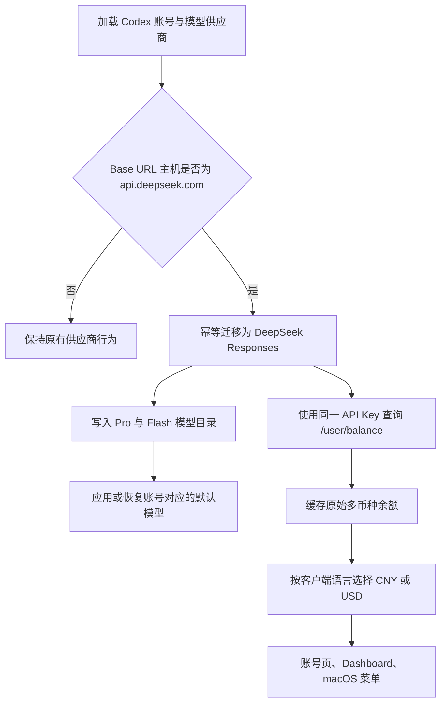

# 设计规格：DeepSeek Responses 接入与余额查询

**日期：** 2026-08-03

**状态：** 已确认
**作者：** Codex 与用户

## 1. 目标

Cockpit Tools 将 DeepSeek 官方 API 作为 Codex 的原生 Responses 供应商接入，并为 DeepSeek API Key 账号提供余额查询。

完成后：

- DeepSeek 官方账号只使用 Responses API，不再进入 Chat Completions gateway。
- 新账号和既有官方 DeepSeek 账号都拥有 `deepseek-v4-pro` 与 `deepseek-v4-flash`。
- 既有官方 DeepSeek 账号在升级后自动迁移，不要求用户手动切换协议。
- DeepSeek 余额沿用当前额度缓存、刷新入口和展示位置。
- 简体中文与繁体中文优先显示 CNY，其他语言优先显示 USD。

## 2. 官方依据

- [接入 Codex](https://api-docs.deepseek.com/zh-cn/quick_start/agent_integrations/codex)
- [使用 Responses API](https://api-docs.deepseek.com/zh-cn/guides/responses_api)
- [查询余额](https://api-docs.deepseek.com/zh-cn/api/get-user-balance)

官方文档确认 Codex 通过 Responses API 与 DeepSeek 通信，配置核心为：

```toml
[model_providers.deepseek]
base_url = "https://api.deepseek.com/"
wire_api = "responses"
experimental_bearer_token = "<DeepSeek API Key>"
```

Responses API 的主要兼容约束：

- API 无状态，不支持 `previous_response_id` 与 `conversation`。
- 流式响应以 `response.completed`、`response.incomplete` 或 `response.failed` 结束，没有 `data: [DONE]`。
- Function 与 Web Search 工具受支持。
- Custom 工具仅支持名为 `apply_patch` 的工具。
- 图片和文件输入不受支持。
- 未支持的顶层参数通常被静默忽略。

官方页面在本文档确认时仍提示 Pro 稍后开放。产品决策明确覆盖该提示：本次同时支持 Pro 与 Flash，不设计后续“模型上新”流程。

## 3. 已确认范围

### 3.1 包含

- DeepSeek 供应商能力从 Chat Completions 调整为原生 Responses。
- 官方 DeepSeek Base URL 规范化。
- 既有账号、供应商记录和当前 Codex 配置的幂等迁移。
- DeepSeek 专用 Codex 模型目录元数据。
- 默认模型选择及切出 DeepSeek 时的模型恢复。
- `GET /user/balance` 查询、解析、缓存和展示。
- Codex 账号页、Dashboard 与 macOS 原生菜单中的余额展示。
- 所有现有客户端语言的必要翻译键。
- 单元测试、类型检查和人工验收矩阵。

### 3.2 不包含

- DeepSeek Chat Completions 兼容开关。
- DeepSeek 协议切换入口。
- 自定义 DeepSeek 中转服务的自动迁移。
- 后台定时轮询余额。
- 新增依赖或新增独立余额存储。
- 自研 Responses SSE 转换器或 DeepSeek 专用本地 sidecar。

## 4. 当前状态与缺口

当前仓库已经有 DeepSeek 供应商预设和两个模型，但仍存在以下缺口：

1. `src/utils/codexProviderGateway.ts` 将 DeepSeek 归入 Chat Completions 供应商。
2. `src-tauri/src/modules/codex_local_access.rs` 的主机推断也把 `api.deepseek.com` 归入 Chat Completions。
3. 既有账号可能持久化了 `api_wire_api = "chat_completions"`，升级后不会自动改变。
4. 当前模型目录从通用 GPT 模板生成，未完整表达 DeepSeek 官方 Codex 元数据。
5. 额度查询只识别 `sub2api` 与 `new_api`，没有 DeepSeek 的 `/user/balance`。
6. 当前单值 `balance + unit` 无法表达官方返回的多币种 `balance_infos`。

## 5. 总体流程



## 6. DeepSeek Responses 接入设计

### 6.1 官方供应商识别

自动行为只基于解析后的 URL 主机名：

```text
api.deepseek.com
```

识别时忽略主机名大小写，并接受现有根路径或 `/v1` 配置。迁移后统一保存为：

```text
https://api.deepseek.com
```

仅供应商名称包含 `DeepSeek`、但主机不同的自定义中转服务不迁移，也不强制改写协议。

### 6.2 能力配置

DeepSeek 从 Chat Completions 推断集合中移除，能力固定为：

| 能力 | 值 |
|---|---|
| Wire API | `responses` |
| Adapter | `openai_responses_native` |
| Gateway strategy | `passthrough` |
| 默认启用方式 | `direct` |
| 是否需要 gateway | 否 |
| 是否支持 direct | 是 |

应用不增加 DeepSeek 请求或 SSE 转换层。Codex 客户端直接访问 DeepSeek Responses API；Cockpit Tools 只负责配置、模型目录与账号生命周期。

### 6.3 模型目录

固定模型顺序：

1. `deepseek-v4-pro`
2. `deepseek-v4-flash`

继续复用现有 Codex 模型模板，只对两个 DeepSeek 模型覆盖官方所需元数据，避免复制整份大型 `models.json` 或引入新的目录框架。

关键元数据：

| 字段 | 值 |
|---|---|
| `context_window` | `1048576` |
| `max_context_window` | `1048576` |
| `effective_context_window_percent` | `95` |
| `prefer_websockets` | `false` |
| `input_modalities` | `text` |
| `supports_parallel_tool_calls` | `true` |
| `apply_patch_tool_type` | `freeform` |
| `web_search_tool_type` | `text` |
| `default_reasoning_level` | `high` |
| 推理档位 | `low`、`high`、`max` |
| `minimal_client_version` | `0.144.0` |
| `supported_in_api` | `true` |

### 6.4 默认模型与恢复

切入 DeepSeek 时：

1. 当前模型为 Pro 或 Flash 时保持不变。
2. 当前模型不是 DeepSeek 模型时，先备份原模型，再将默认模型设为 `deepseek-v4-pro`。
3. 模型选择器同时展示 Pro 与 Flash。

切出 DeepSeek 时：

1. 当前模型仍为 Pro 或 Flash 时，恢复进入 DeepSeek 前备份的模型。
2. 用户已经手动选择其他模型时，不覆盖用户选择。
3. 恢复或确认无需恢复后，清理本次受管备份。

模型备份优先复用现有 provider gateway 的备份约定，不新增第二套通用配置系统。

## 7. 自动迁移设计

迁移必须幂等，应用每次加载旧数据都可以安全执行。

### 7.1 账号记录

对 API Key 账号且官方主机为 `api.deepseek.com` 的记录：

- 将 Base URL 规范化为 `https://api.deepseek.com`。
- 将 `api_wire_api` 设置为 `responses`。
- 将模型目录设置为 Pro 与 Flash。
- 保留 API Key、账号名称、标签和其他凭据元数据。
- 记录已经选择的 Pro 或 Flash；没有有效选择时按默认模型规则处理。

### 7.2 模型供应商记录

对 `codex_model_providers.json` 中官方 DeepSeek 主机的记录：

- 将 `wireApi` 设置为 `responses`。
- 将 `integrationType` 设置为 `deepseek`。
- 将 `modelCatalog` 规范化为 Pro 与 Flash。
- 不迁移同名但非官方主机的记录。

### 7.3 当前配置与实例

若被迁移账号当前处于启用状态：

- 立即重写对应 Codex 目录的 `config.toml` 与受管模型目录。
- 停止并清理该账号旧的 provider gateway 状态和模型覆盖。
- 默认 Codex 目录和受 Cockpit Tools 管理的 Codex 实例都应用相同迁移。
- 迁移失败时保留原持久化数据并返回可诊断错误，避免部分写入。

## 8. DeepSeek 余额查询设计

### 8.1 请求

```http
GET https://api.deepseek.com/user/balance
Accept: application/json
Authorization: Bearer <DeepSeek API Key>
```

余额 URL 必须从已验证的官方主机直接构造为 `/user/balance`，不能在旧 `/v1` 路径后简单追加。

DeepSeek 供应商直接选择 `deepseek` 查询模式，不先探测 `new_api` 或 `sub2api`，避免无意义请求。

### 8.2 数据模型

官方金额字段是十进制字符串。应用保留字符串，不使用浮点数参与金额存储或计算。

```ts
type DeepSeekBalanceInfo = {
  currency: string;
  totalBalance: string;
  grantedBalance: string;
  toppedUpBalance: string;
};

type DeepSeekUsageSummary = {
  mode: "deepseek";
  isAvailable: boolean;
  balanceInfos: DeepSeekBalanceInfo[];
  latencyMs: number;
};
```

后端将官方 snake_case 字段映射为现有前端使用的 camelCase JSON。原始响应不写入新的数据库或文件；它继续保存在现有 API Key usage cache 中。

### 8.3 首选余额币种

| 客户端语言 | 首选币种 |
|---|---|
| `zh-cn` | CNY |
| `zh-tw` | CNY |
| 其他全部语言 | USD |

选择规则：

1. 使用项目现有语言规范化结果，不读取操作系统区域设置。
2. 在 `balanceInfos` 中按币种大小写不敏感匹配首选币种。
3. 找不到首选币种时，回退到接口返回的第一条记录。
4. 回退后始终显示记录的真实币种，不伪装成首选币种。
5. 数组为空时显示暂无余额数据。

### 8.4 展示字段

DeepSeek 余额展示：

- 总余额 `totalBalance`
- 赠金余额 `grantedBalance`
- 充值余额 `toppedUpBalance`

沿用现有金额样式：USD 使用 `$`，CNY 显示数值与 `CNY` 标识。DeepSeek 没有“今日请求”和“今日 Token”数据，因此不显示两个无意义的零值字段。

### 8.5 余额不可用

`isAvailable = false` 是成功响应中的账户状态：

- 显示“余额不可用”。
- 不显示响应中可能同时存在的金额。
- 不标记为网络或 API 错误。
- 保留手动刷新操作。

### 8.6 请求失败

网络错误、非 2xx 响应或 JSON 解析失败：

- 不阻止账号导入、编辑、切换或启动 Codex。
- 沿用现有额度错误与重试处理。
- 可以继续显示上一次成功缓存，同时标记本次刷新失败。
- 错误日志不得包含 API Key，响应摘要保持现有长度限制。

## 9. 刷新与缓存

不增加定时轮询，沿用当前机制：

- 导入 DeepSeek API Key 后立即查询一次。
- 账号切换或账号更新时，如果缓存已超过 10 分钟则刷新。
- 用户可以从现有刷新按钮强制刷新。
- 使用现有 `agtools.codex.apiKeyUsage.cache.v1`，不迁移缓存 key。
- 新增字段必须完整通过缓存序列化与恢复。

## 10. 展示范围

不增加新入口，在现有额度位置增加 `deepseek` 模式：

1. Codex 账号页的卡片、表格与详情。
2. Dashboard 的 Codex API Key 账号概览。
3. macOS 原生菜单的 Codex 额度区域。

三个入口使用相同的可用状态、币种选择和金额字段规则。

## 11. 预计修改位置

| 文件 | 责任 |
|---|---|
| `src/utils/codexProviderGateway.ts` | DeepSeek 改为 Responses direct |
| `src/utils/codexProviderPresets.ts` | 固定 Pro 与 Flash 目录及官方地址 |
| `src/services/codexModelProviderService.ts` | 供应商记录迁移与 `deepseek` 类型 |
| `src/services/modelProviderUsageService.ts` | DeepSeek 余额类型、模式和币种选择 helper |
| `src/components/model-provider/ModelProviderUsagePanel.tsx` | 共享余额展示兼容 |
| `src/components/codex/CodexModelProviderManager.tsx` | 供应商额度查询识别 DeepSeek |
| `src/pages/CodexAccountsPage.tsx` | 账号页余额与现有缓存行为 |
| `src/pages/DashboardPage.tsx` | Dashboard 余额展示 |
| `src/i18n/index.ts`、`src/locales/*.json` | 语言判断复用与新增文案 |
| `src-tauri/src/commands/codex.rs` | `/user/balance` 请求、解析和 summary |
| `src-tauri/src/modules/codex_account.rs` | 账号迁移、模型目录、默认模型与恢复 |
| `src-tauri/src/modules/codex_local_access.rs` | 移除 DeepSeek Chat gateway 推断并清理旧状态 |
| `src-tauri/src/modules/codex_protocol.rs` | DeepSeek 模型元数据覆盖 |
| `src-tauri/src/modules/macos_native_menu.rs` | 原生菜单余额展示 |

实现时以实际调用链为准；若某个展示点已完全复用共享组件，不为形式上的文件清单制造重复代码。

## 12. 测试计划

### 12.1 Rust 单元测试

- 根路径和 `/v1` 都生成 `https://api.deepseek.com/user/balance`。
- 非 HTTP(S)、空 URL 与非官方主机不会进入 DeepSeek 查询。
- 正确解析 CNY、USD 和全部十进制字符串字段。
- `is_available=false` 保持业务状态而非错误。
- 非 2xx 和无效 JSON 返回现有风格的可诊断错误。
- 官方 DeepSeek 旧账号从 Chat Completions 幂等迁移为 Responses。
- 同名自定义中转服务保持不变。
- Pro/Flash 当前模型得到保留，无效模型默认 Pro。
- 切出 DeepSeek 时恢复备份；用户手动改模后不覆盖。
- 两个 DeepSeek 模型生成预期 Codex 元数据。

### 12.2 前端检查

- `zh-cn` 与 `zh-tw` 选择 CNY。
- 其他每个支持语言选择 USD。
- 目标币种缺失时回退第一条，并显示真实币种。
- `isAvailable=false` 只显示“余额不可用”。
- 缓存写入和恢复不丢失 `balanceInfos`。
- 三个展示入口不出现“今日请求/今日 Token”的假零值。

### 12.3 验证命令

```bash
npm run typecheck
cargo test --manifest-path src-tauri/Cargo.toml
```

### 12.4 人工验收

- 新增 DeepSeek API Key 后立即看到余额和两个模型。
- 旧 DeepSeek Chat Completions 账号升级后无需操作即可启动 Codex Responses。
- Pro 与 Flash 均可发起包含工具调用的 Codex 会话。
- 简中、繁中、英文分别显示正确首选币种。
- API Key 无余额、失效、网络断开时分别呈现正确状态。
- DeepSeek 与 OpenAI/OAuth 账号来回切换后，默认模型正确恢复。
- 自定义中转服务的协议和模型目录未被迁移。

## 13. 完成标准

- [ ] DeepSeek 官方账号不再触发 Chat Completions gateway。
- [ ] 新旧账号都使用 Responses 且提供 Pro、Flash。
- [ ] 迁移幂等，不修改自定义中转服务。
- [ ] 模型默认值、备份和恢复符合确认规则。
- [ ] 余额查询使用官方 `/user/balance` 和 Bearer 认证。
- [ ] 多币种、不可用状态和请求失败被正确区分。
- [ ] 三个现有入口遵循相同语言与展示规则。
- [ ] 现有 10 分钟缓存和手动刷新行为保持不变。
- [ ] 不新增依赖、sidecar、轮询器或协议切换 UI。
- [ ] TypeScript 类型检查和 Rust 测试通过。
